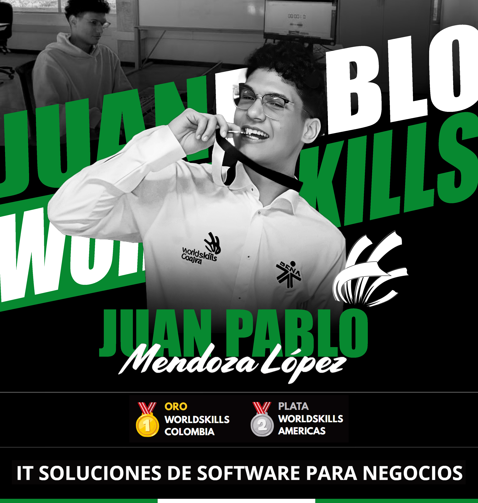

# 👋 Hi there, I'm Juan Pablo Mendoza Lopez!

### A motivated software developer from Colombia

---

---

## 💫 About Me

Software Developer focused on Backend and Analytics, specialized in the .NET ecosystem and the creation of high-impact technological solutions. My professional journey has been shaped by the discipline of SENA La Guajira and the technical rigor of WorldSkills, experiences that have strengthened my ability to tackle complex challenges with a strategic, results-driven mindset.

Throughout my career, I have been dedicated to modernizing projects and designing architectures that transform ideas into robust, scalable tools. My main focus lies in solution engineering and process automation, optimizing workflows to turn them into engines of operational efficiency. This passion for technical excellence led me to earn the Gold Medal at WorldSkills Colombia and the Silver Medal at WorldSkills Americas in the Software Development skill.

My vision for the future is clear: I aim to lead globally scaled projects where data analytics and backend development converge to drive real change across industries. I aspire to continue raising the standard of national technological development, embracing challenges that allow me not only to apply my expertise, but also to inspire through engineering that fuels digital transformation with purpose and a strong business vision.

---

## 🌐 Social Links

---

## 🛠 Technologies & Tools

---

## 📊 GitHub Stats

---

✨ *Always learning. Always improving.* ✨

